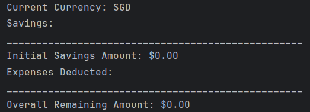
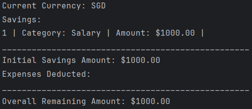
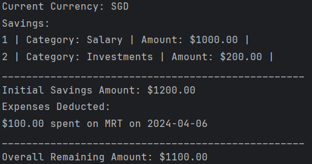
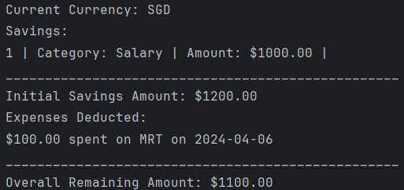
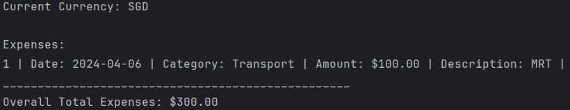
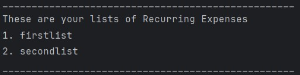
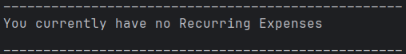

# User Guide

## Introduction
BudgetBuddy is a product for users who wish to handle and track any current/future expenses on a singular platform. 
BudgetBuddy provides a faster and more efficient way to track and calculate expenses and provides the ability 
to deal with finances on a singular platform with ease as long as you can type fast.

## Quick Start
1. Ensure that you have Java 11 installed.
2. Download the latest version of `BudgetBuddy` from [here](https://github.com/AY2324S2-CS2113-T12-3/tp/releases/tag/v2.0).
3. Copy the file to the folder you want to use as the home folder.
4. Open  command terminal, ``cd`` into the folder you put your jar file in, and use the `java -jar BudgetBuddy.jar` 
command to run the application.

## Features
1. Display Commands()
2. Add Expense
3. Add Savings
4. Add Split Expenses
5. Edit Savings
6. Edit Expense
7. Reduce Savings
8. Delete Expense
9. List Savings
10. List Expense
11. Check Splitted Expenses
12. Settle Splitted Expenses
13. Find Expense
14. Recurring Bill Description
15. Add Recurring Bill
16. List Recurring Bills
17. Remove Recurring Bill
18. Add Expense to a Recurring Bill
19. View Expenses in a Recurring Bill
20. Add Expenses in a Recurring Bill to Overall Expenses
21. Change Currency
22. Set Budget
23. Get Budget
24. Print Budget
25. Get Graphical Insights for expenses
26. Get Graphical Insights for savings

### Display Commands : `menu`
Displays the corresponding features of BudgetBuddy

Format: `menu [INDEX]`

* The `INDEX` refers to the number associated with each menu option. If `INDEX` is not provided **OR** 
is of value `0`, the overall menu list will be displayed
* `INDEX` must be either be empty OR a positive integer and a valid index in the menu list

Example of usage:

`menu` : Displays all menu list items

`menu 1` : Displays commands related to feature associated to menu list item 1

### Add Expense
Records a new expense under a specific category with a detailed description.

Format: `add expense c/CATEGORY a/AMOUNT d/DESCRIPTION`

* Increments expense of the specified CATEGORY by AMOUNT given.
* The category under which the expense is to be recorded. It must match one of the 
  pre-defined categories exactly (not case-insensitive):
    Housing
    Groceries
    Utility
    Transport
    Entertainment
    Others
* The `AMOUNT` is the amount to add to the expense. It must be a positive number and can include 
  up to two decimal places.
* The `DESCRIPTION` is a brief description of the expense. Accepts any text string.

Example of Usage:

`add expense c/Entertainment a/167 d/Bruno Mars`

### Add Savings
Adds a specified amount to the savings under a particular category.

Format:  `add savings c/CATEGORY a/AMOUNT`

* Increments savings of the specified CATEGORY by AMOUNT given.
* The category for the savings increment. It must be one of the pre-defined 
  categories (not case-insensitive):
    Salary
    Investments
    Gifts
    Others
* The `AMOUNT` is the amount to add to the savings. It must be a positive number 
  and can include up to two decimal places.

Example of Usage:

`add savings c/Salary a/500.50`

### Add Split Expenses
Add expenses that are meant for splitting among friends or colleague

Format: `split expenses a/AMOUNT n/NUMBER_OF_PEOPLE d/DESCRIPTION`

* Increments split expenses 
* The `AMOUNT` must be a positive number
* The `NUMER_OF_PEOPLE` must be a positive integer.
* The `DESCRIPTION` can be any string

Example of usage:

`split expenses a/100 n/10 d/Lunch

### Edit Savings: `edit savings`
Edit Savings that have been added previously.

Format: `edit savings c/CATEGORY i/INDEX a/AMOUNT`

* The `CATEGORY` must be one of the following pre-defined categories: "Salary",
  "Investments", "Gifts" or "Others".
* The `INDEX` must be a positive integer and a valid index in the menu list.
* The `AMOUNT` must be a positive integer.

Example of usage:

`edit savings c/Salary i/2 a/180 d/Monthly Salary`

Expected Output:

`Saving edited successfully.`

### Edit Expenses: `edit expense`
Edit expenses that have been added previously.

Format: `edit expense c/CATEGORY i/INDEX a/AMOUNT d/DESCRIPTION`

* The `CATEGORY` must be one of the following pre-defined categories: "Housing",
  "Groceries", "Utility", "Transport", "Entertainment" or "Others".
* The `INDEX` must be a positive integer and a valid index in the menu list.
* The `AMOUNT` must be a positive integer.
* The `DESCRIPTION` can be any string.

Example of usage:

`edit expense c/Entertainment i/3 a/30 d/movie`

Expected Output:

`Expense edited successfully.`

### Reduce Savings: `reduce savings`

Reduces the amount saved in a particular category

Format: `reduce savings i/INDEX a/AMOUNT`

* The `INDEX` must be a positive integer and a valid index in the menu list.
* The `AMOUNT` to be reduced must be a positive integer

Example of usage:

`reduce savings i/4 a/10`
Reduces the savings of category of index 4 listed in the savings tracker by $10

### Delete Expense: `delete expense`

Deletes expenses that have been added wrongly or are no longer relevant.

Format: `delete expense i/INDEX`

* The `INDEX` must be a positive integer and a valid index in the menu list.

Example of usage:

`delete expense i/4` 
Deletes the expense of at index 4 listed in the expenditure tracker.

**Note:**
- Once an expense is deleted, it cannot be recovered.

### Listing Savings: `list savings`

Lists savings

Format: `list savings CATEGORY`

* The `CATEGORY` is optional and can be left blank.
* The `CATEGORY` must be a pre-existing category if inputted.
* Similar to listing expenses, users can view their savings with optional category filtering.
* Savings are listed along with their respective categories and amounts.
* Filtered Categories will only display savings with that Category.
  * **DOES NOT** affect total savings.
  * If there are no listings with the filtered category, nothing will be shown.
* Total savings are displayed at the end of the list, after deducting relevant expenditures.
  * **NOT** affected by filtered categories. (i.e will ignore filter category when calculating overall remaining amount)
* Currency of listed savings is stated at the top. 

Example Usage:

`list savings`
`list savings Salary`
`list savings Investment`

Expected Output (Empty Saving List) :

Expected Output (Empty Expense List) :

Expected Output (Expense Recorded) :

Expected Output (Filtered Category) :

### Listing Expenses: `list expenses`

Lists expenses

Format: `list expenses CATEGORY`

* The `CATEGORY` is optional and can be left blank.
* The `CATEGORY` must be a pre-existing category if inputted.
* When listing expenses, users have the option to filter expenses based on categories.
* Users can specify a category to view expenses related to that category only.
  * Index is **NOT** affected so as to facilitate easier identification for deletion.
* If no category is specified, the system will list all expenses. 
  * If there are no listings with the filtered category, nothing will be shown.
* The listed expenses include details such as the date of the expense, category, amount, and description.
* Total expenses are displayed at the end of the list.
  * **NOT** affected by filtered categories. (i.e Filtered Category still displays overall total expenses.)
* Currency of listed expenses is stated at the top.

Example Usage:

`list expenses`
`list expenses Transport`
`list expenses Housing`

Expected Output (Empty Expense List) :

Expected Output (Expense Recorded): 

Expected Output (Filtered Category) :

### Check splitted expenses `check splitted expenses`

Check expenses

Format: `check splitted expenses`

* the system will list all splitted expenses.
* The listed splitted expenses include details such as the total amount spent, number of people in the bill, description and the amount payable by each person.

### Settle splitted expenses `settle expense`

Settle splitted expenses

Format `settle i/Index`

* The system will settle the splitted expense corresponding to `Index`
* `Index` must be a positive integer

### Finding expenses : `find expenses`

Finds expenses based on their description or amount

Format : `find expenses d/DESCRIPTION morethan/MINAMOUNT lessthan/MAXAMOUNT`

* All prefixes `d/`, `morethan/` and `lessthan` **must be** present
* `DESCRIPTION`, `MINAMOUNT`, `MAXAMOUNT` are optional to use as long as *at least* one parameter used.
* Leaving either `DESCRIPTION`, `MINAMOUNT`, `MAXAMOUNT` empty assumes that the parameter is not considered when finding expenses
* `DESCRIPTION` is the description associated with the expenses the user wishes to find
* `MINAMOUNT` is the filter for expenses with amounts higher than specified value
* `MAXAMOUNT` is the filter for expenses with amounts lower than specified value

Examples of usage :

`find expenses d/coffee morethan/ lessthan/ ` : Finds all expenses with the word "coffee" in the description
`find expenses d/coffee morethan/200 lessthan/ ` : Finds all expenses with the word "coffee" and amount higher than $200
`find expenses d/coffee morethan/200 lessthan/400 ` : Finds all expenses with the word "coffee" and amount higher than $200, but lesser than $400

### Recurring Bill Description
The next few features in the user guide would be related to the Recurring Bill Feature. The commands associated to
this overall feature would start with the `rec` command, followed by the relevant `commandType` and parameters. This
feature allows user to create and manage multiple lists of expenses **separate** from the user's overall expenses
, which can be added to the users overall expenses.

The term **recurring** here is to indicate that a user is able to **add** a set of pre-defined expenses to their
overall expenses at any given point in time. Hence, this could range from subscription payments, a future grocery list,
etc.

### Add Recurring Bill : `rec newlist`

Adds a new recurring Bill.

Format : `rec newlist LISTNAME`

* `LISTNAME` refers to the name you wish to associate the recurring Bill with
* `LISTNAME` cannot be empty
* This command is **space sensitive**, in particular the space between `rec`, `newlist` and `LISTNAME`
should be **exactly** one space apart for the command to be recognised

Examples of usage :

`rec newlist Subscriptions` : Creates a new empty recurring bill named `Subscriptions`

### List all Recurring Bills : `rec viewlists`

Lists all recurring bill names, along with their associated list number

Format : `rec viewlists`

* This command is **space sensitive**, in particular, the space between `rec` and `viewlists` must be
**exactly** one space apart for the command to be recognised 
* **Note** Anything typed after `rec viewlists` will be ignored.

Examples of Output : 

When there are already added recurring bills :

When there are no added recurring bills

### Remove Recurring Bill : `rec removelist`

Removes a recurring bill

Format : `rec removelist LISTNUMBER`

* `LISTNUMBER` refers to the associated list number of recurring bill when doing a `rec viewlists`
* `LISTNUMBER` must be a **valid** integer > 0, and should be a **valid** list number

Examples of usage :

`rec removelist 2` : Removes the 2nd recurring bill in the list of recurring bills

### Add an expense to a recurring bill : `rec newexpense`

Adds an expense to a specified recurring bill

Format : `rec newexpense to/LISTNUMBER c/CATEGORY a/AMOUNT d/DESCRIPTION`

* `LISTNUMBER` refers to the associated list number of recurring bill when doing a `rec viewlists`
* `CATEGORY` refers to the category of the expense you wish to add
* `AMOUNT` refers to the amount value of the expense you wish to add
* `DESCRIPTION` refers to the description of the expense you wish to add
* `LISTNUMBER` must be a **valid** integer, and should be a **valid** list number
* `CATEGORY`, `AMOUNT` and `DESCRIPTION` follows the same constraints as if you were to add a normal expense.
* `to/, c/, a/, d/` must be placed in the **right order**
* **Note** Although the user is able to combine the prefixes without any spaces, etc. 
`rec newexpense to/1c/Entertainmenta/200d/movies`, it is strongly recommended to ensure spaces for clarity.

Examples of usage :
`rec newexpense to/1 c/Entertainment a/200 d/movies` : Adds a new expense to the 1st recurring bill 
, with category as Entertainment, amount as 200 and description as Movies

### View expenses in a recurring bill : `rec viewexpenses`

Views all expenses in a specified recurring bill

Format : `rec viewexpenses LISTNUMBER`

* `LISTNUMBER` refers to the associated list number of the recurring bill when doing a `rec viewlists`
* `LISTNUMBER` must be a **valid** integer, and should be a **valid** list number
* This command is **space sensitive**, in particular, the space between `rec` and `viewlists` must be
  **exactly** one space apart for the command to be recognised

Examples of usage :
`rec viewexpenses 1` : Prints all expenses in the 1st recurring bill

### Add expenses in a recurring bill to overall expenses : `rec addrec`

Adds all expenses in a specified recurring bill to the overall expenses

Format : `rec addrec LISTNUMBER`

* `LISTNUMBER` refers to the associated list number of the recurring bill when doing a `rec viewlists`
* `LISTNUMBER` must be a **valid** integer, and should be a **valid** list number
*  You may wish to perform a `list expenses` to view the newly added expenses being added to the
overall list of expenses

Examples of usage :
`rec addrec 1` : Adds all expenses in the 1st recurring bill into the overall expenses

### Changing Currencies : `change currency [CURRENCY_CODE]`

Converts current currency to targeted currency

Format : `change currency [CURRENCY_CODE]`

* Default currency is 'SGD'.
* Current Currency can be identified when listing savings/expenses.
* `CURRENCY_CODE` consists of the following currencies: 'SGD', 'USD', 'EUR', 'MYR', 'JPY', 'KRW', 'CNY', 'HKD'
* `CURRENCY_CODE` cannot be null. 
* Conversion of Currency is interchangeable (e.g. SGD -> USD -> JPY).
* Future additions to Expenses/Savings will be using the current currency displayed.
  * (i.e. **ALL** Expenses/Savings will be converted to the new currency.)
* Currency Icon will standardise to use universal `$`.

Examples of usage:

`change currency USD` : Converts current currency into USD

Expected Output (SGD -> USD) :

Expected Output (USD -> USD) :

### Setting Budgets: 

Sets budget for specified category

Format: `set budget c/CATEGORY b/BUDGET`

* `CATEGORY` must be a pre-existing category
* `BUDGET` must be a positive integer

Example of usage: 
`set budget c/Housing b/1000` : Sets a budget of $1000 for Housing category

### Getting budget for specific category:

Retrieves the budget for the specified category, also lists expenses in descending order,
and shows the percentage of budget that each expense takes up.

Format: `get budget c/CATEGORY`

* `CATEGORY` must be a pre-existing category

Example of usage: 
`get budget c/Transport`: Retrieves the set budget for transport (if any), lists expenses 
in transport category in ascending order, and shows % of budget taken up by each of them.

### Print all the budgets

* Prints all the budgets in a table (Table 1)
* Table 1 contains information about amount spent, remaining amount and % of budget spent for each category
* If any of the budgets have been exceeded, will be displayed in another table (Table 2)
* Table 2 contains categories that exceeded budget and amount exceeded.

Format: `print budget`

### Get Graphical Insights for expenses: `get expenses insights`
* This feature provides an overview of the expenses distribution across different categories. 
* A horizontal bar graph showing the percentage of total expenses attributed to each category.
* It highlights the category with the highest expenses, the one with the lowest (excluding categories with no expenses),
* and lists any categories where no expenses have been recorded.
* Categories are Housing, Groceries, Utility, Transport, Entertainment, and Others.

Example of usage: `get expenses insights`

### Get Graphical Insights for savings: `get savings insights`
* This feature offers a comprehensive look at how your savings are allocated across various categories. 
* A horizontal bar graph showing the percentage of total savings attributed to each category.
* It highlights the category with the highest savings, the one with the lowest (excluding categories with no savings),
* and lists any categories where no savings have been added.
* Categories are Salary, Investments, Gifts, and Others

Example of Usage: `get savings insights`

### Saving the data

BudgetBuddy data is automatically saved to the hard disk after any command that changes the data. There is no need to save manually.

However, the exceptions to these are the following features. Where no implementation of saving and loading has been added for these features :
* Setting Budgets
* Splitted Expenses

### Editing the data file

BudgetBuddy data is saved automatically as a text file `[JAR file location]/data/*.txt`. Where * represents the different names of the files
. Four files should be created upon first startup of BudgetBuddy : `SavingsFile.txt`, `ExpenseFile.txt`, `RecurringExpensesFile.txt` and `DefaultCurrency.txt`
Advanced users are welcome to update the data directly by editing this file. However, caution is advised as certain edits may cause JunBot to behave unexpectedly.

> ⚠️ **Caution:** Certain edits can cause BudgetBuddy to behave in unexpected ways (e.g. if value entered is outside of acceptable range, or the entries are not in the right format). Therefore, edit the data file only
> if you are confident that you can update it correctly

## Command Summary
* Display Commands : `menu INDEX`
* Add Savings: `add savings c/CATEGORY a/AMOUNT`
* Add Expense: `add expense c/CATEGORY a/AMOUNT d/DESCRIPTION`
* Edit Expenses `edit expense c/CATEGORY i/INDEX a/AMOUNT d/DESCRIPTION`
* Edit Savings `edit savings c/CATEGORY i/INDEX a/AMOUNT`
* List Expenses: `list expenses [CATEGORY]`
* List Savings: `list savings [CATEGORY]`
* Find Expenses `find expenses [d/DESCRIPTION] [morethan/MINAMOUNT] [lessthan/MAXAMOUNT]`
* Change Currency `change currency [CURRENCY_CODE]`
* Set Budget `set budget c/CATEGORY b/BUDGET`
* Get Budget `get budget c/CATEGORY`
* Print Budgets `print budget`
* Get Graphical Insights for expenses `get expenses insights` 
* Get Graphical Insights for savings `get savings insights`

