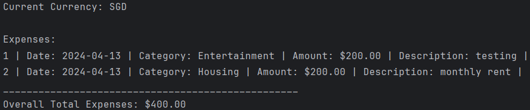
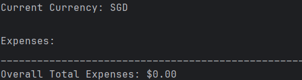
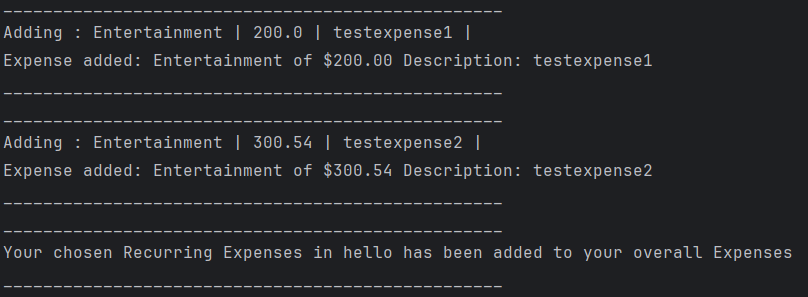
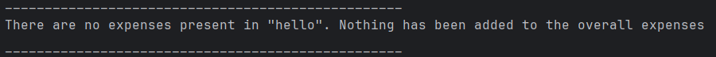
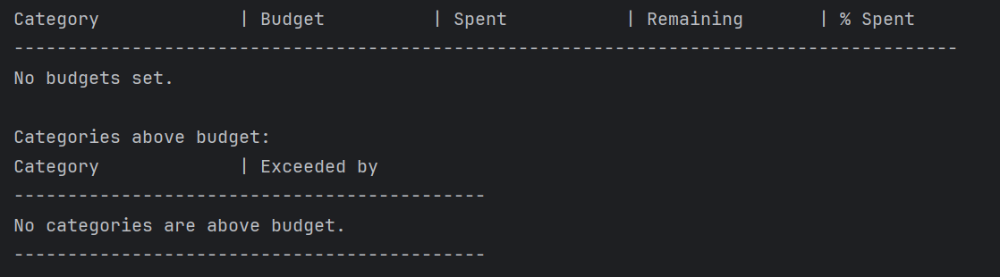
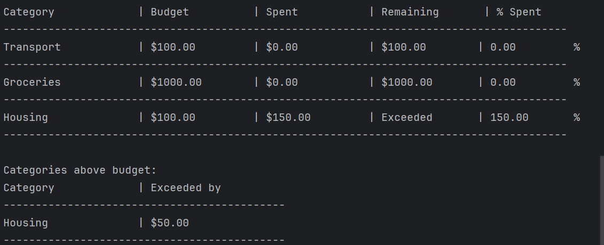

# User Guide

## Table of Contents
[1. Introduction](#1-introduction)  
[2. Quick Start](#2-quick-start)  
[3. Features](#3-features)  
&nbsp;&nbsp;[3.0 General Information](#30-general-information)  
&nbsp;&nbsp;[3.1 Display Commands](#31-display-commands--menu)  
&nbsp;&nbsp;[3.2 Add Expense](#32-add-expense) 
&nbsp;&nbsp;[3.3 Add Savings](#33-add-savings) 
&nbsp;&nbsp;[3.4 Add Split Expenses](#34-add-shared-bill) 
&nbsp;&nbsp;[3.5 Edit Savings](#35-edit-savings-edit-savings) 
&nbsp;&nbsp;[3.6 Edit Expense](#36-edit-expenses-edit-expense) 
&nbsp;&nbsp;[3.7 Reduce Savings](#37-reduce-savings-reduce-savings) 
&nbsp;&nbsp;[3.8 Delete Expense](#38-delete-expense-delete-expense) 
&nbsp;&nbsp;[3.9 List Savings](#39-listing-savings-list-savings) 
&nbsp;&nbsp;[3.10 List Expense](#310-listing-expenses-list-expenses)  
&nbsp;&nbsp;[3.11 Check Splitted Expenses](#311-check-splitted-expenses-check-splitted-expenses) 
&nbsp;&nbsp;[3.12 Settle Splitted Expenses](#312-settle-bill-settle-bill) 
&nbsp;&nbsp;[3.13 Find Expense](#313-finding-expenses--find-expenses) 
&nbsp;&nbsp;[3.14 Recurring Bill Description](#314-recurring-bill-description) 
&nbsp;&nbsp;[3.15 Add Recurring Bill](#315-add-recurring-bill--rec-newlist) 
&nbsp;&nbsp;[3.16 List Recurring Bills](#316-list-all-recurring-bills--rec-viewlists) 
&nbsp;&nbsp;[3.17 Remove Recurring Bill](#317-remove-recurring-bill--rec-removelist) 
&nbsp;&nbsp;[3.18 Add Expense to a Recurring Bill](#318-add-an-expense-to-a-recurring-bill--rec-newexpense) 
&nbsp;&nbsp;[3.19 View Expenses in a Recurring Bill](#319-view-expenses-in-a-recurring-bill--rec-viewexpenses) 
&nbsp;&nbsp;[3.20 Add Expenses in a Recurring Bill to Overall Expenses](#320-add-expenses-in-a-recurring-bill-to-overall-expenses--rec-addrec) 
&nbsp;&nbsp;[3.21 Change Currency](#321-changing-currencies--change-currency-currency_code) 
&nbsp;&nbsp;[3.22 Set Budget](#322-setting-budgets-) 
&nbsp;&nbsp;[3.23 Get Budget](#323-getting-budget-for-specific-category) 
&nbsp;&nbsp;[3.24 Print Budget](#324-print-all-the-budgets) 
&nbsp;&nbsp;[3.25 Get Graphical Insights for expenses](#325-get-graphical-insights-for-expenses-get-expenses-insights) 
&nbsp;&nbsp;[3.26 Get Graphical Insights for savings](#326-get-graphical-insights-for-savings-get-savings-insights) 
&nbsp;&nbsp;[3.27 Exiting the Application](#327-exiting-the-application--bye) 
[4. FAQ](#4-faq) 
[5. Command Summary](#5-command-summary) 
[6. For Advanced Users](#6-for-advanced-users) 

## 1. Introduction
BudgetBuddy is a product for users who wish to handle and track any current/future expenses on a singular platform. 
BudgetBuddy provides a faster and more efficient way to track and calculate expenses and provides the ability 
to deal with finances on a singular platform with ease as long as you can type fast.

## 2. Quick Start
1. Ensure that you have Java 11 installed.
2. Download the latest version of `BudgetBuddy` from [here](https://github.com/AY2324S2-CS2113-T12-3/tp).
3. Copy the file to the folder you want to use as the home folder.
4. Open  command terminal, ``cd`` into the folder you put your jar file in, and use the `java -jar [CS2113-T12-3][BudgetBuddy].jar` 
command to run the application.

## 3. Features

### 3.0 General Information
1. All user input variables are denoted in all caps. Etc, if the format of a command is `menu INDEX`, `INDEX` refers
to the user input variable. Hence, you may input `menu 1`, `menu 2`, `menu string`, etc. depending on the command constraints.
2. User Input variables that are enclosed with a `[]` are denoted as **optional** inputs. Etc, if the format of a command is `menu [INDEX]`,
the user may wish to not include anything for the `INDEX` and just type `menu`.

### 3.1 Display Commands : `menu`

Displays the corresponding features of BudgetBuddy

Format: `menu [INDEX]`

* The `INDEX` refers to the number associated with each menu option. If `INDEX` is not provided **OR** 
is of value `0`, the overall menu list will be displayed
* `INDEX` must be either be empty OR a positive integer and a valid index in the menu list
* The `menu` command is **space sensitive**. In particular, there should only be one space between `menu` and `INDEX`
for the command to be properly recognized should you wish to view a menu item of a certain `INDEX`

Example of usage:

`menu` : Displays all menu list items

`menu 1` : Displays commands related to feature associated to menu list item 1

### 3.2 Add Expense
Records a new expense under a specific category with a detailed description.

Format: `add expense c/CATEGORY a/AMOUNT d/DESCRIPTION`

* Increments expense of the specified CATEGORY by AMOUNT given.
* The category under which the expense is to be recorded. It must match one of the 
  pre-defined categories exactly (not case-insensitive):
    Housing
    Groceries
    Utility
    Transport
    Entertainment
    Others
* The `AMOUNT` is the amount to add to the expense. It must be a positive number and can include 
  up to two decimal places.
* The `DESCRIPTION` is a brief description of the expense. Accepts any text string.

Example of Usage:

`add expense c/Entertainment a/167 d/Bruno Mars`

### 3.3 Add Savings
Adds a specified amount to the savings under a particular category.

Format:  `add savings c/CATEGORY a/AMOUNT`

* Increments savings of the specified CATEGORY by AMOUNT given.
* The category for the savings increment. It must be one of the pre-defined 
  categories (not case-insensitive):
    Salary
    Investments
    Gifts
    Others
* The `AMOUNT` is the amount to add to the savings. It must be a positive number 
  and can include up to two decimal places.

Example of Usage:

`add savings c/Salary a/500.50`

### 3.4 Add Shared Bill
Add bills that are meant for splitting among friends or colleague

Format: `add shared bill a/AMOUNT n/NUMBER_OF_PEOPLE d/DESCRIPTION`

* Increments shared bills 
* The `AMOUNT` must be a positive number
* The `NUMER_OF_PEOPLE` must be a positive integer.
* The `DESCRIPTION` can be any string

Example of usage:

`add shared bill a/100 n/10 d/Lunch`

### 3.5 Edit Savings: `edit savings`
Edit Savings that have been added previously.

Format: `edit savings c/CATEGORY a/AMOUNT`

* The `CATEGORY` must be one of the following pre-defined categories: "Salary",
  "Investments", "Gifts" or "Others". (Case Sensitive)
* The `AMOUNT` must be a positive float.

Example of usage:

`edit savings c/Salary i/2 a/180 d/Monthly Salary`

Expected Output:

`Saving edited successfully.`

### 3.6 Edit Expenses: `edit expense`
Edit expenses that have been added previously.

Format: `edit expense c/CATEGORY i/INDEX a/AMOUNT d/DESCRIPTION`

* The `CATEGORY` must be one of the following pre-defined categories: "Housing",
  "Groceries", "Utility", "Transport", "Entertainment" or "Others". (Case Sensitive)
* The `INDEX` must be a positive integer and a valid index in the menu list.
* The `AMOUNT` must be a positive integer.
* The `DESCRIPTION` can be any string.

Example of usage:

`edit expense c/Entertainment i/3 a/30 d/movie`

Expected Output:

`Expense edited successfully.`

### 3.7 Reduce Savings: `reduce savings`

Reduces the amount saved in a particular category

Format: `reduce savings c/CATEGORY a/AMOUNT`

* The `CATEGORY` must be a string and a valid category in the menu list.
* The `AMOUNT` to be reduced must be a positive integer

Example of usage:

`reduce savings c/Investments a/10`
Reduces the savings of category Investments listed in the savings tracker by $10

### 3.8 Delete Expense: `delete expense`

Deletes expenses that have been added wrongly or are no longer relevant.

Format: `delete expense i/INDEX`

* The `INDEX` must be a positive integer and a valid index in the menu list.

Example of usage:

`delete expense i/4` 
Deletes the expense of at index 4 listed in the expenditure tracker.

**Note:**
- Once an expense is deleted, it cannot be recovered.

### 3.9 Listing Savings: `list savings`

Lists savings

Format: `list savings CATEGORY`

* The `CATEGORY` is optional and can be left blank.
* The `CATEGORY` must be a pre-existing category if inputted.
* The command is not case-sensitive.
* Similar to listing expenses, users can view their savings with optional category filtering.
* Savings are listed along with their respective categories and amounts.
* Filtered Categories will only display savings with that Category.
  * **DOES NOT** affect total savings.
  * If there are no listings with the filtered category, nothing will be shown.
* Total savings are displayed at the end of the list, after deducting relevant expenditures.
  * **NOT** affected by filtered categories. (i.e will ignore filter category when calculating overall remaining amount)
* Currency of listed savings is stated at the top. 

Example Usage:

`list savings`
`list savings Salary`
`list savings Investment`

Expected Output (Empty Saving List) :

Expected Output (Empty Expense List) :

Expected Output (Expense Recorded) :

Expected Output (Filtered Category) :

### 3.10 Listing Expenses: `list expenses`

Lists expenses

Format: `list expenses CATEGORY`

* The `CATEGORY` is optional and can be left blank.
* The `CATEGORY` must be a pre-existing category if inputted.
* The command is not case-sensitive.
* When listing expenses, users have the option to filter expenses based on categories.
* Users can specify a category to view expenses related to that category only.
  * Index is **NOT** affected so as to facilitate easier identification for deletion.
* If no category is specified, the system will list all expenses. 
  * If there are no listings with the filtered category, nothing will be shown.
* The listed expenses include details such as the date of the expense, category, amount, and description.
* Total expenses are displayed at the end of the list.
  * **NOT** affected by filtered categories. (i.e Filtered Category still displays overall total expenses.)
* Currency of listed expenses is stated at the top.

Example Usage:

`list expenses`
`list expenses Transport`
`list expenses Housing`

Expected Output (Empty Expense List) :

Expected Output (Expense Recorded): 

Expected Output (Filtered Category) :

### 3.11 Check splitted expenses `check splitted expenses`

Check Split Bills

Format: `check split bills`

* the system will list all bills that have been split.
* The listed bills include details such as the description, the number of people and the amount payable by each person.

### 3.12 Settle bill `settle bill`

Settle splitted expenses

Format `settle bill i/Index`

* The system will settle the splitted expense corresponding to `Index`
* `Index` must be a positive integer

Example of usage:
`settle bill i/2`: Delete bill of index 2 listed in splittedexpenses tracker

### 3.13 Finding expenses : `find expenses`

Finds expenses based on their description or amount

Format : `find expenses d/[DESCRIPTION] morethan/[MINAMOUNT] lessthan/[MAXAMOUNT]`

* All prefixes `d/`, `morethan/` and `lessthan/` **must be** present
* `DESCRIPTION`, `MINAMOUNT`, `MAXAMOUNT` are optional to use. Leaving them all empty simply obtains the entire expense list.
* Leaving either `DESCRIPTION`, `MINAMOUNT`, `MAXAMOUNT` empty assumes that the parameter is not considered when finding expenses
* `DESCRIPTION` is the description associated with the expenses the user wishes to find
* `MINAMOUNT` is the filter for expenses with amounts higher than or equal to the specified value
* `MAXAMOUNT` is the filter for expenses with amounts lower than or equal to the specified value
* **Note** Although the user is able to combine the prefixes without any spaces, etc.
  `find expenses d/descriptionmorethan/10lessthan/20`, it is strongly recommended to ensure spaces for clarity.
* The `find expenses` portion is **case sensitive**. In particular, there should only be one space between `find` and `expenses`
for the command to be recognized.

Examples of usage :

`find expenses d/coffee morethan/ lessthan/ ` : Finds all expenses with the word "coffee" in the description

`find expenses d/coffee morethan/200 lessthan/ ` : Finds all expenses with the word "coffee" and amount higher than equals to $200

`find expenses d/coffee morethan/200 lessthan/400 ` : Finds all expenses with the word "coffee" and amount higher than equals to $200, but lesser than equals to $400

### 3.14 Recurring Bill Description
The next few features from `3.15` to `3.20` in the user guide would be related to the Recurring Bill Feature. The commands associated to
this overall feature would start with the `rec` command, followed by the relevant `commandType` and parameters. This
feature allows the user to create and manage multiple lists of expenses **separate** from the user's overall expenses
, which can be added to the users overall expenses.

The term **recurring** here is to indicate that a user is able to **add** a set of pre-defined expenses to their
overall expenses at **any** given point in time. Hence, this could range from subscription payments, a future grocery list,
etc.

### 3.15 Add Recurring Bill : `rec newlist`

Adds a new recurring Bill.

Format : `rec newlist LISTNAME`

* `LISTNAME` refers to the name you wish to associate the recurring Bill with
* `LISTNAME` cannot be empty, and cannot contain a `|` or `!`
* This command is **space sensitive**, in particular the space between `rec`, `newlist` and `LISTNAME`
should be **exactly** one space apart for the command to be recognised
* **Note** : You can add bills of the same `LISTNAME` as lists are differentiated by their list position

Examples of usage :

`rec newlist Subscriptions` : Creates a new empty recurring bill named `Subscriptions`

### 3.16 List all Recurring Bills : `rec viewlists`

Lists all recurring bill names, along with their associated list number

Format : `rec viewlists`

* This command is **space sensitive**, in particular, the space between `rec` and `viewlists` must be
**exactly** one space apart for the command to be recognised 
* **Note** : Anything typed after `rec viewlists ` will be ignored.

Examples of Output : 

When there are already added recurring bills :

When there are no added recurring bills

### 3.17 Remove Recurring Bill : `rec removelist`

Removes a recurring bill

Format : `rec removelist LISTNUMBER`

* `LISTNUMBER` refers to the associated list number of recurring bill when doing a `rec viewlists`
* `LISTNUMBER` must be a **valid** integer > 0, and should be a **valid** list number
* This command is **space sensitive**, in particular, the space between `rec` and `removelist` must be
  **exactly** one space apart for the command to be recognised

Examples of usage :

`rec removelist 2` : Removes the 2nd recurring bill in the list of recurring bills

### 3.18 Add an expense to a recurring bill : `rec newexpense`

Adds an expense to a specified recurring bill

Format : `rec newexpense to/LISTNUMBER c/CATEGORY a/AMOUNT d/DESCRIPTION`

* `LISTNUMBER` refers to the associated list number of the recurring bill when doing a `rec viewlists`
* `CATEGORY` refers to the category of the expense you wish to add
* `AMOUNT` refers to the amount value of the expense you wish to add
* **Note** : Any `Amount` that is more than `2 d.p.` is automatically rounded to the nearest `2 d.p.`
* `DESCRIPTION` refers to the description of the expense you wish to add
* `LISTNUMBER` must be a **valid** integer, and should be a **valid** list number
* `CATEGORY`, `AMOUNT` and `DESCRIPTION` follows the same constraints as if you were to add a normal expense.
* `to/, c/, a/, d/` must be placed in the **right order**
* **Note** Although the user is able to combine the prefixes without any spaces, etc. 
`rec newexpense to/1c/Entertainmenta/200d/movies`, it is strongly recommended to ensure spaces for clarity.
* This command is **space sensitive**, in particular, the space between `rec` and `newexpense` must be
    **exactly** one space apart for the command to be recognised

Examples of usage :
`rec newexpense to/1 c/Entertainment a/200 d/movies` : Adds a new expense to the 1st recurring bill 
, with category as Entertainment, amount as 200 and description as Movies

### 3.19 View expenses in a recurring bill : `rec viewexpenses`

Views all expenses in a specified recurring bill

Format : `rec viewexpenses LISTNUMBER`

* `LISTNUMBER` refers to the associated list number of the recurring bill when doing a `rec viewlists`
* `LISTNUMBER` must be a **valid** integer, and should be a **valid** list number
* This command is **space sensitive**, in particular, the space between `rec` and `viewlists` must be
  **exactly** one space apart for the command to be recognised
* **Note** : In the output, the `Date` refers to the date the expense was added to the Recurring Expense List

Examples of usage :
`rec viewexpenses 1` : Prints all expenses in the 1st recurring bill

Here are some expected outputs for different situations :

When the list to view contains expenses : 

When the list to view does not contain any expenses : 

### 3.20 Add expenses in a recurring bill to overall expenses : `rec addrec`

Adds all expenses in a specified recurring bill to the overall expenses

Format : `rec addrec LISTNUMBER`

* `LISTNUMBER` refers to the associated list number of the recurring bill when doing a `rec viewlists`
* `LISTNUMBER` must be a **valid** integer, and should be a **valid** list number
* This command is **space sensitive**, in particular, the space between `rec` and `addrec` must be
    **exactly** one space apart for the command to be recognised
*  You may wish to perform a `list expenses` to view the newly added expenses being added to the
overall list of expenses

Examples of usage :
`rec addrec 1` : Adds all expenses in the 1st recurring bill into the overall expenses

Here are some expected outputs for different situations : 

When the list to add contains 2 expenses : 

When the list to add is empty: 

### 3.21 Changing Currencies : `change currency [CURRENCY_CODE]`

Converts current currency to targeted currency

Format : `change currency [CURRENCY_CODE]`

* Default currency is 'SGD'.
* Current Currency can be identified when listing savings/expenses.
* `CURRENCY_CODE` consists of the following currencies: 'SGD', 'USD', 'EUR', 'MYR', 'JPY', 'KRW', 'CNY', 'HKD'
* `CURRENCY_CODE` cannot be null. 
* `CURRENCY_CODE` is not case-sensitive.
* Conversion of Currency is interchangeable (e.g. SGD -> USD -> JPY).
* Future additions to Expenses/Savings will be using the current currency displayed.
  * (i.e. **ALL** Expenses/Savings will be converted to the new currency.)
* Currency Icon will standardise to use universal `$`.

Examples of usage:

`change currency USD` : Converts current currency into USD

Expected Output (SGD -> USD) :

Expected Output (USD -> USD) :

### 3.22 Setting Budgets: 

Sets budget for specified category

Format: `set budget c/CATEGORY b/BUDGET`

* `CATEGORY` must be a pre-existing category
* `BUDGET` must be a positive integer

Example of usage: 
`set budget c/Utility b/100` 

Expected output (if there is no existing budget): 

Expected output (if there is already an existing budget):

### 3.23 Getting budget for specific category:

Retrieves the budget for the specified category, also lists expenses in descending order,
and shows the percentage of budget that each expense takes up.

Format: `get budget c/CATEGORY`

* `CATEGORY` must be a pre-existing category

Example of usage: 
`get budget c/Transport`: Retrieves the set budget for transport (if any), lists expenses 
in transport category in ascending order, and shows % of budget taken up by each of them.

### 3.24 Print all the budgets

* Prints all the budgets in a table (Table 1)
* Table 1 contains information about amount spent, remaining amount and % of budget spent for each category
* If any of the budgets have been exceeded, will be displayed in another table (Table 2)
* Table 2 contains categories that exceeded budget and amount exceeded.

Format: `print budget`

Example of Expected Output (If there is no existing expenses):

Example of Expected Output (If there are existing expenses):

### 3.25 Get Graphical Insights for expenses: `get expenses insights`
* This feature provides an overview of the expenses distribution across different categories. 
* A horizontal bar graph showing the percentage of total expenses attributed to each category.
* It highlights the category with the highest expenses, the one with the lowest (excluding categories with no expenses),
and lists any categories where no expenses have been recorded.
* Categories are Housing, Groceries, Utility, Transport, Entertainment, and Others. (Case Sensitive)

Example of usage: `get expenses insights`

Example of Expected Output:

### 3.26 Get Graphical Insights for savings: `get savings insights`

* This feature offers a comprehensive look at how your savings are allocated across various categories. 
* A horizontal bar graph showing the percentage of total savings attributed to each category.
* It highlights the category with the highest savings, the one with the lowest (excluding categories with no savings),
and lists any categories where no savings have been added.
* Categories are Salary, Investments, Gifts, and Others (Case Sensitive)

Example of Usage: `get savings insights`

Example of Expected Output:

### 3.27 Exiting the application : `bye`

## 4. FAQ

This section answers some frequently asked questions.

### Why can I only add amounts less than 1,000,000,000,000.00
In BudgetBuddy, we set a maximum limit on transaction amounts to ensure consistent functionality across different systems. Since variable storage capacities can vary
, this limit helps prevent errors and maintain reliable operations. With the richest man in the world having
an approximate net worth of 231,000,000,000. We believe that the cap should be sufficient to most users.

### What happens if the total amount of all expenses is above 1,000,000,000,000.00
Exceeding the maximum limit of 1,000,000,000,000.00 for total expenses can lead to calculation errors and issues in data representation 
due to the limited range of numbers the application can handle. 
While we strongly recommend staying within this limit to avoid such problems, 
most users should find that BudgetBuddy meets their needs without issue.

### How do I transfer my data to another computer.

The save files for BudgetBuddy are stored in `[JAR file location]/data/`.  
Copy all contents found in the `data` folder to the new location.

### Can I include my own category?

As of current version (v2.1), the feature to include your own category has not been implemented yet. It may come in a future release.

### Why are there only so little currency codes available?

As of the current version (v2.1), we plan to include more conversion codes in future updates as we expand on the program.

### Are the conversion values accurate in real-time?

As our program does not require Internet access, the conversion ratios are taken as of the release date for each version of BudgetBuddy.  
(i.e. v2.1 released on 15 Apr 2024, so conversion ratios are taken as of that date)  

## 5. Command Summary
* Display Commands: `menu [INDEX]`
* Add Savings: `add savings c/CATEGORY a/AMOUNT`
* Add Expense: `add expense c/CATEGORY a/AMOUNT d/DESCRIPTION`
* Add Shared Bill: `a/AMOUNT n/NUMBER_OF_PEOPLE d/DESCRIPTION`
* Edit Expenses: `edit expense c/CATEGORY i/INDEX a/AMOUNT d/DESCRIPTION`
* Edit Savings: `edit savings c/CATEGORY a/AMOUNT`
* Reduce Savings: `reduce savings c/CATEGORY a/AMOUNT`
* Delete Expense: `delete expense i/INDEX`
* List Expenses: `list expenses [CATEGORY]`
* List Savings: `list savings [CATEGORY]`
* Check Splitted Expenses: `check split bills`
* Settle Bill: `settle bill i/Index`
* Find Expenses: `find expenses d/[DESCRIPTION] morethan/[MINAMOUNT] lessthan/[MAXAMOUNT]`
* Add Recurring Bill: `rec newlist LISTNAME`
* List all Recurring Bills: `rec viewlists`
* Remove Recurring Bill: `rec removelist LISTNUMBER`
* Add an Expense to a Recurring Bill: `rec newexpense to/LISTNUMBER c/CATEGORY a/AMOUNT d/DESCRIPTION`
* View expense in a Recurring Bill: `rec viewexpenses LISTNUMBER`
* Add expenses in a Recurring Bill to overall Expenses: `rec addrec LISTNUMBER`
* Change Currency: `change currency [CURRENCY_CODE]`
* Set Budget: `set budget c/CATEGORY b/BUDGET`
* Get Budget: `get budget c/CATEGORY`
* Print Budgets: `print budget`
* Get Graphical Insights for expenses: `get expenses insights`
* Get Graphical Insights for savings: `get savings insights`
* Exiting the application: `bye`

## 6. For Advanced Users:

### 6.1 Saving the data
BudgetBuddy data is automatically saved to the hard disk after any command. There is no need to save manually.

**Note** : As the data to be saved depends on the **current state** of the application, any manual changes made to
the files **during** the run of the application will not be reflected in the application.

### 6.2 Editing the data file

BudgetBuddy data is saved automatically as a text file `[JAR file location]/data/*.txt`. Where * represents the different names of the files
. Five files should be created upon first startup of BudgetBuddy : `SavingsFile.txt`, `ExpenseFile.txt`, `RecurringExpensesFile.txt`, `DefaultCurrency.txt` and `SplitExpensesFile.txt`
Advanced users are welcome to update the data directly by editing this file. However, caution is advised as certain edits may cause JunBot to behave unexpectedly.

#### RecurringExpensesFile.txt
For advanced users who wish to edit the `RecurringExpensesFile.txt`, do take note of the following

* `!!! NAME !!!` will denote the creation of a RecurringExpenseList with the name as the specified `NAME`
* The list number of each RecurringExpenseList is determined by the position of its associated `!!! NAME !!!` in `RecurringExpensesFile.txt`, where the highest in the file would have its associated list number as `1`.
* `LISTNUMBER | DATE | CATEGORY | AMOUNT | DESCRIPTION` will denote the addition of an expense into the `RecurringExpenseList` associated with the provided `LISTNUMBER`
* `DATE`, `CATEGORY`, `AMOUNT` and `DESCRIPTION` follow the same restrictions as if a user were to normally add an expense within the application itself. 
* On top of the restrictions stated in the previous point, do note that `CATEGORY` is **case-sensitive** here. Hence, `entertainment` is considered an invalid category as it should be `Entertainment`
* Any `AMOUNT` that is more than 2 decimal places will be automatically treated as 2 d.p.
* The file is considered **corrupted** as long as the inputs are out of place / invalid. Etc. invalid category, invalid amount, wrong format for naming a recurring list

> ⚠️ **Caution:** Certain edits can cause BudgetBuddy to behave in unexpected ways (e.g. if value entered is outside the acceptable range, or the entries are not in the right format). Therefore, edit the data file only
> if you are confident that you can update it correctly

